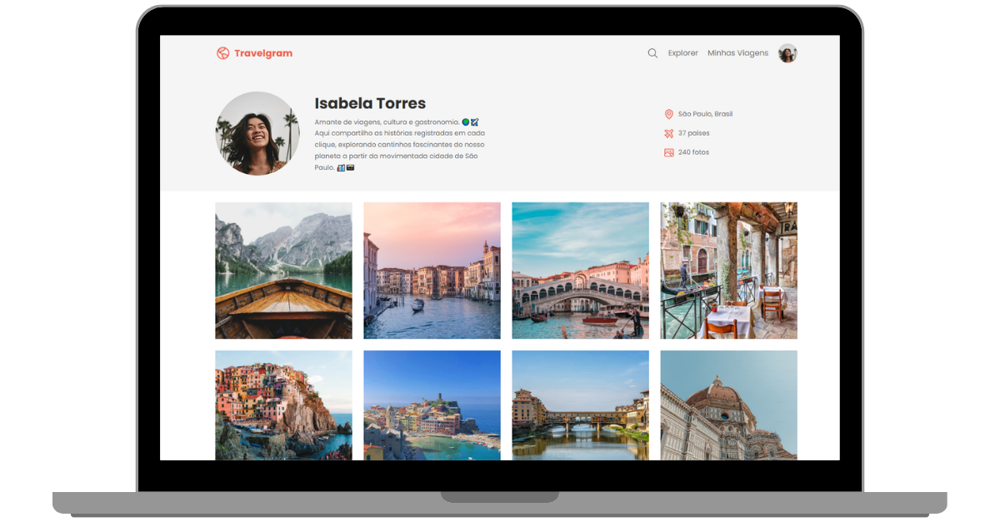

# Projeto: Perfil de Viagens 🌍

Este projeto foi feito como parte das aulas da Rocketseat, onde o desafio era criar uma página simples exibindo o perfil de uma pessoa viajante com nome, descrição e uma lista de países visitados.

Este foi um projeto guiado pelo professor em vídeo e serviu muito bem pra aplicar tudo que já tinha aprendido nas aulas anteriores.

## 💻 Tecnologias usadas

- HTML5
- CSS3

## 🧠 O que aprendi e pratiquei

Antes de fazer esse projeto, tive várias aulas sobre Flexbox e esse foi meu primeiro projeto aplicando de verdade o que aprendi. Usei:

- `display: flex` pra organizar o layout
- `flex-direction` pra alinhar os elementos em coluna
- `justify-content` e `align-items` pra controlar alinhamento
- `flex-wrap` para que os elementos quebrem a linha quando necessário

Além disso, organizei o CSS dividindo em múltiplos arquivos, e centralizei os imports em um único arquivo principal. Isso ajudou a manter a estrutura mais limpa e modular.

Também reforcei pontos importantes como:

- Organização do HTML com boas tags semânticas
- Uso correto de classes e espaçamentos no CSS
- Escrita de código limpo e estruturado

## 📌 Sobre o projeto

Mesmo sendo um projeto guiado, foi ótimo ver como os conceitos que estudei fizeram mais sentido na prática e ver o resultado final funcionando.

---

Próximo passo: seguir praticando e quando chegar nas aulas de responsividade para mobile (que falta pouco) voltar nesse projeto e deixar ele adaptado pra diferentes telas.

## 🔗 Link do projeto:
[Abrir Projeto](https://andrey00005.github.io/Perfil-de-viagens/)

